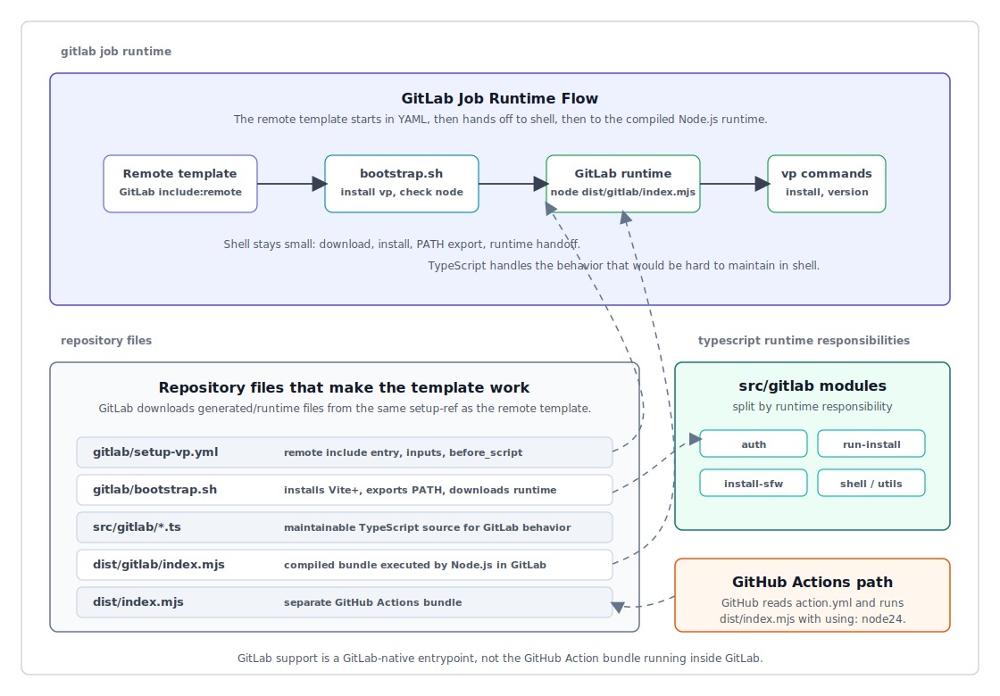

# RFC: setup-vp GitLab CI/CD Remote Template

## Summary

This RFC proposes a GitLab CI/CD remote template for `voidzero-dev/setup-vp`.
The template lets GitLab users install Vite+, configure registry auth, and
optionally run `vp install` while keeping the source of truth in this GitHub
repository.

The template is published as a plain YAML file plus a shell bootstrap. The
maintainable runtime is TypeScript under `src/gitlab/` and is distributed as a
precompiled JavaScript bundle under `dist/gitlab/`.

```text
gitlab/setup-vp.yml
gitlab/bootstrap.sh
src/gitlab/*.ts
dist/gitlab/index.mjs
```

GitLab users load it with `include:remote`:

```yaml
include:
  - remote: "https://raw.githubusercontent.com/voidzero-dev/setup-vp/v1/gitlab/setup-vp.yml"

test:
  extends: .setup-vp
  image: node:24
  script:
    - vp run test
```

## Motivation

`setup-vp` is currently a GitHub Action. Its TypeScript implementation depends
on the GitHub Actions runtime, including action inputs, path management, state,
outputs, and post-action cache behavior. GitLab CI/CD cannot execute that action
directly with equivalent semantics.

The goal is to provide a GitLab-native entry point without creating a separate
GitLab project or mirror. GitLab supports remote YAML includes, so a template
hosted from GitHub can be reused directly by GitLab pipelines.

Relevant GitLab documentation:

- https://docs.gitlab.com/ci/yaml/#includeremote
- https://docs.gitlab.com/ci/yaml/#includeinputs
- https://docs.gitlab.com/ci/yaml/#includeintegrity
- https://docs.gitlab.com/ci/caching/
- https://docs.gitlab.com/ci/migration/github_actions/

## Goals

1. Provide a GitLab CI/CD template from this GitHub repository only.
2. Support `include:remote` with `spec:inputs`.
3. Keep GitLab input names as close as possible to the GitHub Action inputs.
4. Install Vite+ from the official installer with retry and fallback URLs.
5. Support the default `run-install: true` experience and advanced
   `run-install` entries with `cwd` and `args`.
6. Support private registry auth through `registry-url`, `scope`, and
   `NODE_AUTH_TOKEN`.
7. Support `sfw: true` for `vp install`.
8. Require Node.js in the selected GitLab runner image, matching the model that
   the runtime script is executed by Node.js.
9. Document where GitLab behavior cannot match GitHub Actions.

## Non-Goals

1. Do not create or require a GitLab project.
2. Do not publish a GitLab CI/CD component.
3. Do not use `include:component` for the initial design.
4. Do not run the GitHub Action bundle (`dist/index.mjs`) inside GitLab.
5. Do not implement GitHub Actions cache semantics inside the GitLab template.
6. Do not provide Windows runner support in the initial template.

## Design

### Distribution Model

The template is stored in this repository and referenced by raw GitHub URL.

```yaml
include:
  - remote: "https://raw.githubusercontent.com/voidzero-dev/setup-vp/v1/gitlab/setup-vp.yml"
```

Consumers should pin a tag or commit instead of `main`. GitLab 17.9+ users can
also use `include:integrity` when they want to pin the remote file hash.

```yaml
include:
  - remote: "https://raw.githubusercontent.com/voidzero-dev/setup-vp/v1.0.0/gitlab/setup-vp.yml"
    integrity: "sha256-..."
    inputs:
      run-install: "true"
```

`include:component` is intentionally not used. It is designed for GitLab CI/CD
components resolved from a GitLab component project, which conflicts with the
"GitHub repository only" constraint.

### Template Shape

`gitlab/setup-vp.yml` defines two YAML documents and intentionally stays thin:

1. `spec:inputs` for GitLab include inputs.
2. A hidden `.setup-vp` job that exports inputs, downloads `bootstrap.sh`, and
   executes it.

```yaml
spec:
  inputs:
    version:
      default: "latest"
    working-directory:
      default: "."
    run-install:
      default: "true"
    sfw:
      type: boolean
      default: false
    registry-url:
      default: ""
    scope:
      default: ""
    setup-ref:
      default: "v1"
---
.setup-vp:
  before_script:
    - |
      # export inputs, download bootstrap.sh, and execute it
```

### Bootstrap And Runtime

Implementation logic is split to keep shell small:

- `gitlab/setup-vp.yml` handles GitLab inputs and downloads `bootstrap.sh`.
- `gitlab/bootstrap.sh` installs Vite+, checks that Node.js is available,
  downloads `dist/gitlab/index.mjs`, and runs it.
- `src/gitlab/*.ts` handles maintainable logic split by responsibility:
  registry auth, `sfw`, `run-install` parsing, install execution, shell helpers,
  path resolution, and final orchestration.
- `dist/gitlab/index.mjs` is generated from `src/gitlab/index.ts` by
  `vp pack`, mirroring how the GitHub Action runs `dist/index.mjs` generated
  from TypeScript.

This intentionally requires users to choose a runner image that already contains
Node.js, such as `node:24`. GitLab remote templates run inside the user-selected
image, so requiring Node.js keeps the template simple and avoids bootstrapping a
runtime before the compiled JavaScript can execute.

Remote includes do not provide a portable way for the included YAML to discover
the exact Git ref used in the `include:remote` URL. For that reason the template
has a `setup-ref` input. The default points at `v1`, and users who need strict
reproducibility should pass the same tag or commit SHA as the template include.

```yaml
include:
  - remote: "https://raw.githubusercontent.com/voidzero-dev/setup-vp/v1.0.0/gitlab/setup-vp.yml"
    inputs:
      setup-ref: "v1.0.0"
```

The runtime handoff is intentionally explicit:



### Execution Flow

The hidden job runs in `before_script` so that the user's `script` can assume
`vp` is available.

1. Export GitLab inputs into `SETUP_VP_*` environment variables.
2. Download and execute `bootstrap.sh` from `setup-ref`.
3. Install Vite+ from `https://viteplus.dev/install.sh`.
4. Fall back to the raw GitHub installer if the primary installer fails.
5. Add `~/.vite-plus/bin` to `PATH`.
6. Verify that `node` is available in the runner image.
7. Download and execute `dist/gitlab/index.mjs` from `setup-ref`.
8. Resolve `working-directory`.
9. Configure temporary npm auth when `registry-url` is set.
10. Install or detect `sfw` when `sfw: true`.
11. Run `vp install` when `run-install` is enabled.
12. Print `vp --version`.

### Node.js Runtime Requirement

The GitLab template does not expose `node-version` or `node-version-file`.
Instead, jobs must select an image or environment where Node.js is already
available:

```yaml
test:
  extends: .setup-vp
  image: node:24
  script:
    - vp run test
```

This differs from the GitHub Action, where GitHub provides a built-in Node.js
runtime for actions. In both cases, TypeScript source is not executed directly:
GitHub Actions runs `dist/index.mjs`, and the GitLab template runs
`dist/gitlab/index.mjs`.

### Run Install

The default matches GitHub Actions:

```yaml
run-install: "true"
```

The GitLab template also supports multiple install entries:

```yaml
include:
  - remote: "https://raw.githubusercontent.com/voidzero-dev/setup-vp/v1/gitlab/setup-vp.yml"
    inputs:
      run-install: |
        - cwd: ./packages/app
          args: ['--frozen-lockfile']
        - cwd: ./packages/lib

test:
  extends: .setup-vp
  image: node:24
  script:
    - vp run test
```

This is intentionally modeled after the GitHub Action's structured
`run-install` input rather than adding a separate `install-args` input. Keeping
one input avoids diverging user experience between GitHub and GitLab.

### Socket Firewall Free

`sfw: true` wraps install commands as `sfw vp install ...`.

```yaml
include:
  - remote: "https://raw.githubusercontent.com/voidzero-dev/setup-vp/v1/gitlab/setup-vp.yml"
    inputs:
      sfw: true
      run-install: "true"
```

If `sfw` is already on `PATH`, the template reuses it. Otherwise it downloads a
pinned `sfw-free` release for Linux or macOS when a matching binary exists. If
the runner architecture is unsupported, the template logs a warning and falls
back to plain `vp install`.

## Public API

| Input               | Default  | Description                                                                   |
| ------------------- | -------- | ----------------------------------------------------------------------------- |
| `version`           | `latest` | Version of Vite+ to install.                                                  |
| `working-directory` | `.`      | Project directory used for relative paths and default `vp install` execution. |
| `run-install`       | `true`   | Run `vp install`; accepts boolean or YAML object/array with `cwd` and `args`. |
| `sfw`               | `false`  | Wrap `vp install` with Socket Firewall Free.                                  |
| `registry-url`      |          | Optional registry URL to write to a temporary `.npmrc`.                       |
| `scope`             |          | Optional scope for authenticating against scoped registries.                  |
| `setup-ref`         | `v1`     | Ref used to download `bootstrap.sh` and `dist/gitlab/index.mjs`.              |

## GitHub Action Parity

| Capability              | GitHub Action | GitLab template | Notes                                        |
| ----------------------- | ------------- | --------------- | -------------------------------------------- |
| Install Vite+           | Yes           | Yes             | GitLab uses shell in `before_script`.        |
| `node-version`          | Yes           | No              | GitLab requires Node.js in the runner image. |
| `node-version-file`     | Yes           | No              | GitLab requires Node.js in the runner image. |
| `working-directory`     | Yes           | Yes             | Used for relative paths and default install. |
| `run-install`           | Yes           | Yes             | Structured `cwd` and `args` are supported.   |
| `registry-url`          | Yes           | Yes             | GitLab requires `NODE_AUTH_TOKEN` variable.  |
| `scope`                 | Yes           | Yes             | Same input name.                             |
| `sfw`                   | Yes           | Yes             | GitLab supports Unix-like runners only.      |
| `cache`                 | Yes           | No              | GitLab cache is job-level YAML behavior.     |
| `cache-dependency-path` | Yes           | No              | See cache section below.                     |

## Cache Design

The GitLab template does not expose `cache` or `cache-dependency-path` inputs.
This is an intentional difference.

The GitHub Action restores cache during the action's main phase and saves cache
during the action's post phase. GitLab cache is configured as a job keyword and
is restored by the runner before `before_script` starts. A remote template
running shell commands inside `before_script` cannot compute dynamic cache paths
and then ask GitLab to restore those paths for the same job.

GitLab users should configure `cache:` on their jobs directly:

```yaml
test:
  extends: .setup-vp
  image: node:24
  cache:
    key:
      files:
        - pnpm-lock.yaml
    paths:
      - .pnpm-store/
  script:
    - vp run test
```

Follow-up cache work should happen separately after deciding whether Vite+ should
support a stable project-local package manager cache directory for GitLab.

## Security

Remote includes execute as CI configuration, so examples should recommend
pinning:

- Prefer `v1`, an immutable version tag such as `v1.0.0`, or a commit SHA.
- Avoid `main` in production pipelines.
- Use `include:integrity` where available for stricter remote file validation.
- Pin `setup-ref` to the same immutable tag or commit SHA when strict
  reproducibility is required. `include:integrity` validates the included YAML,
  not the bootstrap or compiled runtime downloaded by that YAML.

The template downloads installers and optional `sfw` binaries at runtime. The
downloaded `sfw` version is pinned in the template for reproducibility. Users
who need stronger supply-chain guarantees can install a SHA-pinned `sfw` binary
before extending `.setup-vp`; the template will reuse `sfw` from `PATH`.

## Rollout

1. Add `gitlab/setup-vp.yml`.
2. Add `gitlab/bootstrap.sh`.
3. Add the `src/gitlab/` TypeScript runtime modules.
4. Generate `dist/gitlab/index.mjs` with `vp pack`.
5. Add this RFC under `rfcs/`.
6. Document GitLab usage in `README.md`.
7. Validate YAML parsing and shell/Node syntax locally.
8. Validate the remote include through GitLab CI Lint before release.
9. Release under `v1` and an immutable semver tag.
